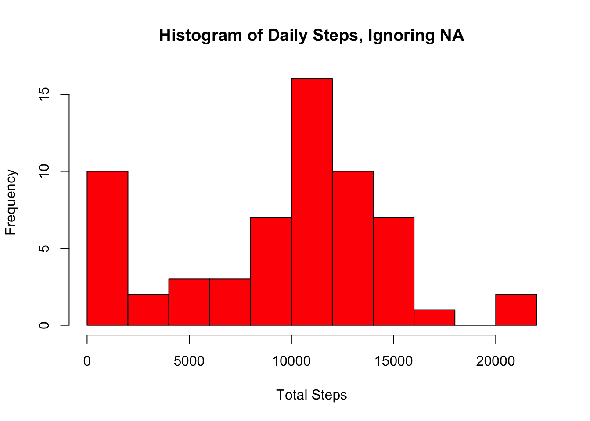

# Background  

This R Markdown document was created for the assignment of "Reproducible Research" course by [coursera](https://www.coursera.org/)  


More information about the assignment, see [README.md](https://github.com/happyjjl/RepData_PeerAssessment1/blob/master/README.md)  


# Assignment  

The data for this assignment can be downloaded from the course web site:

* Dataset: [Activity monitoring data](https://d396qusza40orc.cloudfront.net/repdata%2Fdata%2Factivity.zip)  

After download, unzip the downloaded file to your working directory, make sure the unzipped file "activity.csv" existed  

## Loading and preprocessing the data:  

```r
library(plyr)
library(lattice)

walk_data <- read.csv("activity.csv")
```

## What is mean total number of steps taken per day?  

1. Make a histogram of the total number of steps taken each day


```r
day_total_steps <- ddply(walk_data, .(date), summarise, totalSteps = sum(steps, na.rm=TRUE)) 
hist(day_total_steps$totalSteps, 
     breaks = 10, 
     xlab = "Total Steps", 
     main = "Histogram of Daily Steps, Ignoring NA",
     col = "red"
)
```



2. Calculate and report the mean and median total number of steps taken per day  


```r
day_step_mean <- mean(day_total_steps$totalSteps, na.rm = TRUE)
day_step_median <- median(day_total_steps$totalSteps, na.rm = TRUE)
```

mean total number of steps taken per day: 9354.23  
median total number of steps taken per day: 10395  

## What is the average daily activity pattern?  

1. Make a time series plot (i.e. type = "l") of the 5-minute interval (x-axis) and the average number of steps taken, averaged across all days (y-axis)  


```r
mean_interval <- ddply(walk_data, .(interval), summarise,  AverageSteps = mean(steps, na.rm=TRUE))
plot(mean_interval$interval, 
     mean_interval$AverageSteps, 
     type = "l", 
     xlab = "5 min interval", 
     ylab = "Average Steps", 
     main = "Average Steps per interval",
     col="red"
)
```


2. Which 5-minute interval, on average across all the days in the dataset, contains the maximum number of steps?  


```r
max_steps_mean_index <- which.max(mean_interval$AverageSteps)
```

No 104 5-minute interval cantains the max number of steps.  

## Imputing missing values  

1. Calculate and report the total number of missing values in the dataset  


```r
sum_na <- sum(is.na(walk_data))
```

total number of missing values: 2034 NAs

2. Create a new dataset that is equal to the original dataset but with the missing data filled with the mean for that 5-minute interval


```r
walk_data_new <- merge(walk_data, mean_interval, by="interval", sort=TRUE)
index <- is.na(walk_data_new$steps) 
walk_data_new$steps[index] <- walk_data_new$AverageSteps[index] 
```

3. Make a histogram of the total number of steps taken each day with new dataframe.


```r
day_total_steps2 <- ddply(walk_data_new, .(date), summarise, totalSteps=sum(steps, na.rm = TRUE)) #Group on date, total steps
hist(day_total_steps2$totalSteps, 
     breaks=10, 
     main = "Histogram of Daily Steps, Including NA", 
     xlab="Total Steps",
     col = "red"
) 
```


```r
day_step_mean2 <- mean(day_total_steps2$totalSteps)
day_step_median2 <- median(day_total_steps2$totalSteps)
```

new mean total number of steps taken per day: 10766.19  
new median total number of steps taken per day: 10766.19 

These values are a little larger than the first part of the assignment, imputing missing data has few impact on the estimates of the total daily number of steps.   

## Are there differences in activity patterns between weekdays and weekends?  


```r
walk_data_new$date <- as.Date(walk_data_new$date)
day_new <- factor(weekdays(walk_data_new$date) %in% c("Saturday", "Sunday"), level=c(TRUE, FALSE), labels=c("weekend", "weekday"))
tmp1 <- mutate(walk_data_new, day = day_new)
tmp2 <- ddply(tmp1, .(interval, day), summarise, averageSteps = mean(steps))
xyplot(averageSteps ~ interval | day, 
       data = tmp2, 
       type = "l",
       layout = c(1, 2),
       ylab = "Average Steps", 
       main = "Average steps , Weekday vs Weekend")
```


The trends of the two figures are similar,average numbers of steps taken per 5-minutes interval across all weekend days are higher on average than that across all weekday days seemly, but maxium value was during weekday.  
